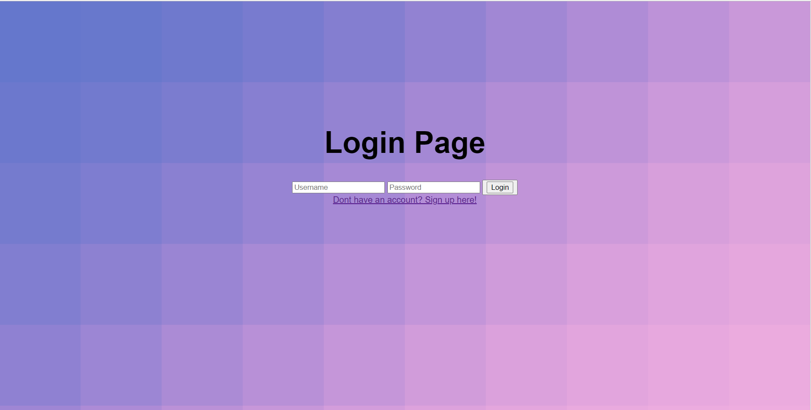
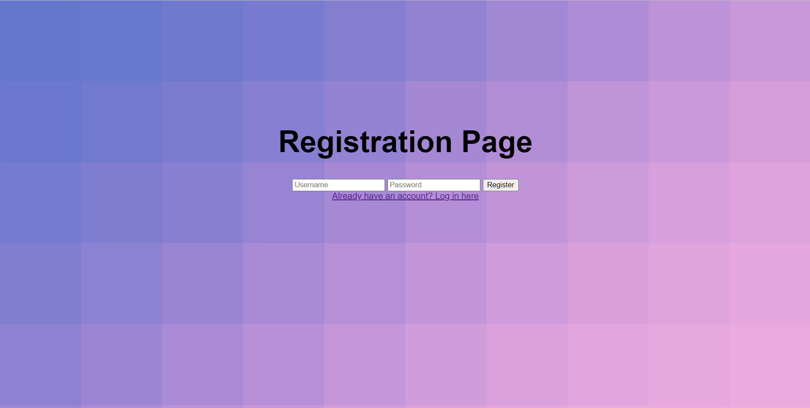
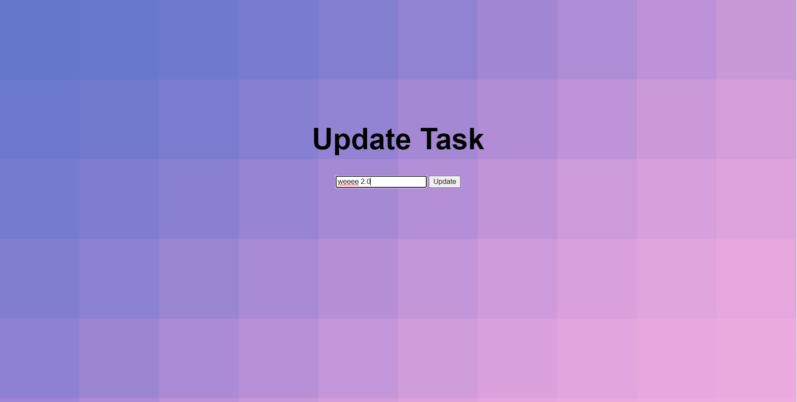

# My Python Todo App 

## My App Features
#
- Create Task 
- Read All Tasks From DB
- Update Task
- Delete Task 
- (CRUD haha^)
- Logs In User
- Registers New Users 
- Logs Out Users
- Mark Tasks As Complete
- Add Due Dates To Tasks 

#

## Tech Stack 
#

 #

 ## My UI 
 #
 **Login In Page** 

 **Register Page** 

 **Task Page** 

 **Update Page** 
 #